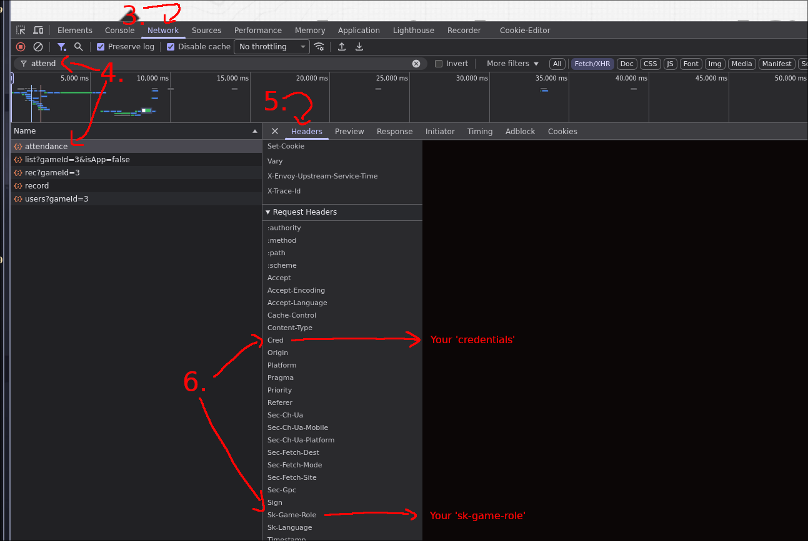

# Pity Patrol

A tool to help you claim web based daily login rewards for your favorite gacha games

- Main Repo: [github.com/atomicptr/pity-patrol](https://github.com/atomicptr/pity-patrol)
- Alt Repo: [gitlab.com/atomicptr/pity-patrol](https://gitlab.com/atomicptr/pity-patrol)

**NOTE**: This isn't intended for use inside GitHub Actions or GitLab CI. Using it there violates the TOS, so don't.

## Supported Games

- [Arknights: Endfield](https://endfield.gryphline.com)
- [Genshin Impact](https://genshin.hoyoverse.com)
- [Honkai Starrail](https://hsr.hoyoverse.com)
- [Honkai Impact 3rd](https://honkaiimpact3.hoyoverse.com)
- [Zenless Zone Zero](https://zenless.hoyoverse.com)
- [Tears of Themis](https://tot.hoyoverse.com)

## Install

Create a config file (see below) and then run:

```bash
$ docker run --rm -v /path/to/config/dir:/app/config quay.io/atomicptr/pity-patrol:latest
```

## Configuration

Here is a list of all configuration options

```toml
user-agent = "Pity Patrol" # Ability to set a custom user agent, keep empty for default (Chrome)
enable-scheduler = false   # Instead of running pity patrol just once, run the jobs automatically at their reset times

# and the most important thing you can add as many accounts as you like
[[accounts]]
# The game identifier, this is used to decide which game
game = "endfield"

# Account identifier, this will be used in logs and with reporters so you can differentiate different accounts
identifier = "My Endfield Account"

# Read "Getting Credentias > Arknights: Endfield" to see how to get these
credentials = "xxxxx"
sk-game-role = "xxxxx"

# Only for scheduler, delays the scheduler execution for this account by 30 minutes
checkin-offset = 30

# adding more accounts is easy just repeat the [[accounts]] object
[[accounts]]
game = "zzz"
identifier = "My ZZZ"

# The hoyo games all use `cookie`
cookie = "mi18nLang=...; ltuid_v2=...; ltoken_v2=v2_..."

# adding a reporter to send you messages
[[reporters]]
type = "discord"
on = ["success", "failure"] # send us both messages on success and on failure

# discord only
webhook-url = "..." # add your discord webhook url for a channel
```

### Configuration Location

#### Docker

In Docker the configuration file is mapped to ``/app/config/config.toml``

#### System

Pity Patrol reads a TOML config file located in

- Linux: ``$XDG_CONFIG_HOME/.config/pity-patrol/config.toml``
- MacOS: ``$HOME/Library/Application Support/pity-patrol/config.toml``
- Windows: ``%APPDATA%\\pity-patrol\\config.toml``

Or a path defined by the env var ``PITY_PATROL_CONFIG``

## Getting Credentials

### Arknights: Endfield

1. Open [https://game.skport.com/endfield/sign-in](https://game.skport.com/endfield/sign-in) (Make sure you are logged in)
2. Open the Browser Console (F12)
3. Go to the Network tab (make sure its recording, there should be a red dot)
4. Search for "attendance"
5. On the right click to "Headers"
6. Look for "Sk-Game-Role" (which is 'sk-game-role') and "Cred" (which is 'credentials')
7. Add them to the config




### Hoyo Games

Instructions for Firefox 

1. Get your cookie string, open the daily check in page
   * [Daily Check-in page for Genshin Impact](https://act.hoyolab.com/ys/event/signin-sea-v3/index.html?act_id=e202102251931481)
   * [Daily Check-in page for Honkai: Star Rail](https://act.hoyolab.com/bbs/event/signin/hkrpg/index.html?act_id=e202303301540311)
   * [Daily Check-in page for Honkai Impact 3rd](https://act.hoyolab.com/bbs/event/signin-bh3/index.html?act_id=e202110291205111)
   * [Daily Check-in page for Zenless Zone Zero](https://act.hoyolab.com/bbs/event/signin/zzz/index.html?act_id=e202406031448091)
   * [Daily Check-in page for Tears of Themis](https://act.hoyolab.com/bbs/event/signin/nxx/index.html?act_id=e202202281857121)
2. Open a development console (F12)
3. Click the arrows and select storage 
4. Expand Cookies and click on the site
5. Copy the relevant cookies "ltoken_v2" and "ltuid_v2"
3. Create a string like "ltoken_v2=....; ltuid_v2=....;" this is your cookie string
4. Add the cookie string to your config
5. Done!

On Chrome, I'd recommend using something like [https://cookie-editor.com](https://cookie-editor.com/) to extract the cookie values

## License

AGPLv3
